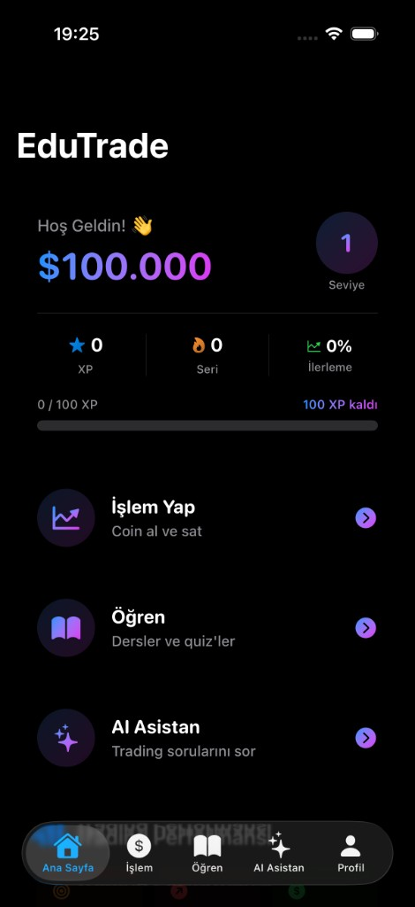
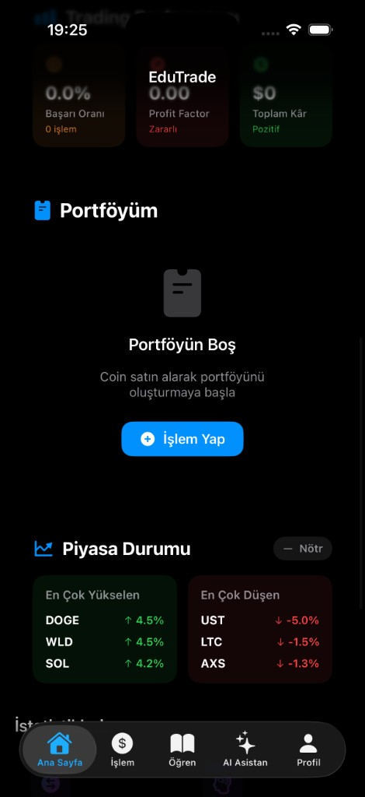
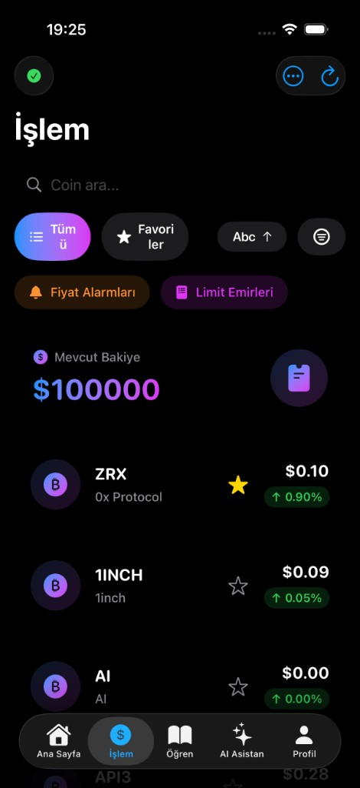
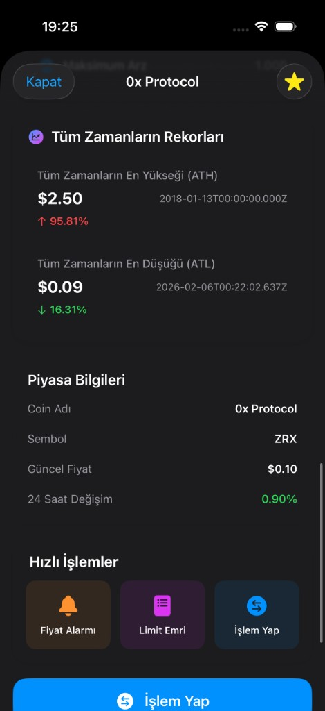
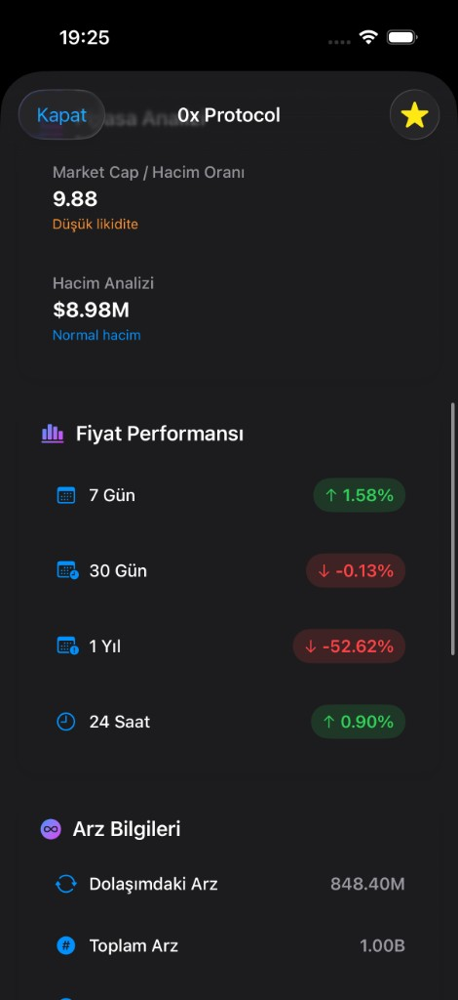
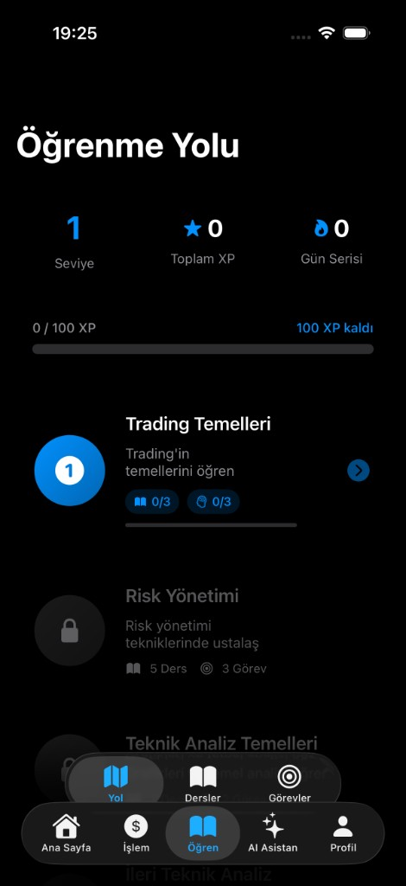
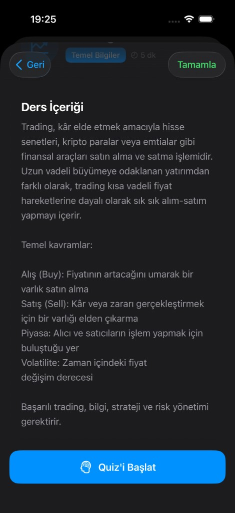
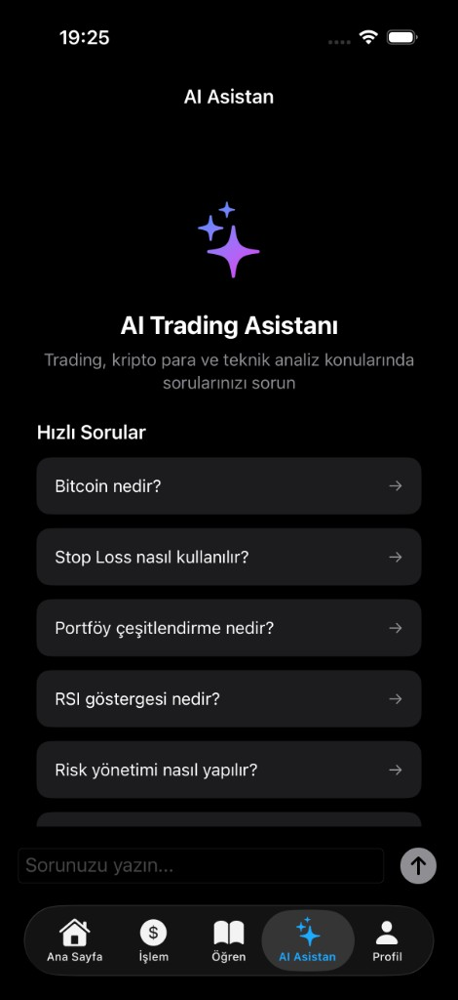
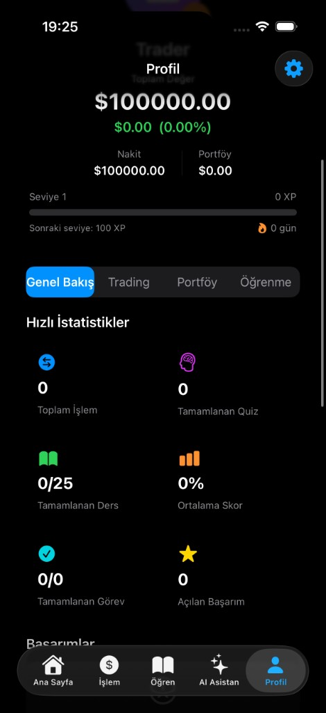
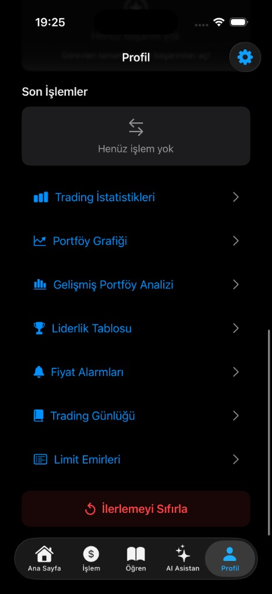

# EduTrade - Kripto Para Eğitim Simülatörü

<p align="center">
  
</p>

<p align="center">
  <strong>Gerçek para riski olmadan kripto para trading'i öğrenin.</strong>
</p>

<p align="center">
  
  
  
  
  
</p>

---

## Hakkında

**EduTrade**, kripto para dünyasına adım atmak isteyen yeni başlayanlar için tasarlanmış kapsamlı bir **eğitim simülasyon uygulamasıdır**. Kullanıcılar sanal para ile gerçek piyasa verilerini takip ederek alım-satım yapabilir, interaktif dersler ve quiz'lerle trading bilgilerini geliştirebilir ve AI destekli asistandan anlık destek alabilir.

### Neden EduTrade?

- **Risk yok** — 100.000$ sanal bakiye ile gerçekçi trading deneyimi
- **Öğrenerek pratik** — Duolingo tarzı öğrenme yolu ile adım adım ilerleme
- **AI desteği** — OpenRouter API entegrasyonu ile anlık sorularınıza cevap
- **Gerçek veriler** — CoinGecko API ile canlı kripto para fiyatları

---

## Ekran Görüntüleri

### Ana Sayfa & Dashboard

<p align="center">
  
  &nbsp;&nbsp;
  
</p>

<p align="center">
  <sub>Hoş geldin ekranı, sanal bakiye, XP takibi ve piyasa durumu</sub>
</p>

### İşlem & Coin Detay

<p align="center">
  
  &nbsp;&nbsp;
  
  &nbsp;&nbsp;
  
</p>

<p align="center">
  <sub>Canlı fiyatlar, favori coinler, detaylı coin analizi ve fiyat performansı</sub>
</p>

### Öğrenme Yolu & Dersler

<p align="center">
  
  &nbsp;&nbsp;
  
</p>

<p align="center">
  <sub>Seviye bazlı öğrenme yolu, interaktif dersler ve quiz sistemi</sub>
</p>

### AI Asistan

<p align="center">
  
</p>

<p align="center">
  <sub>Hızlı sorular ve serbest metin ile AI destekli trading eğitimi</sub>
</p>

### Profil & İstatistikler

<p align="center">
  
  &nbsp;&nbsp;
  
</p>

<p align="center">
  <sub>Detaylı istatistikler, başarımlar, trading günlüğü ve portföy analizi</sub>
</p>

---

## Özellikler

### Trading Simülasyonu
- Canlı kripto para fiyatları (CoinGecko API)
- Market ve Limit emir desteği
- Stop Loss ve Take Profit mekanizmaları
- Portföy yönetimi ve detaylı analiz
- Fiyat alarmları ve bildirimler
- İşlem geçmişi ve trading günlüğü

### Eğitim Sistemi
- 20+ interaktif ders (Temel Analiz, Teknik Analiz, Risk Yönetimi vb.)
- Her ders sonunda quiz değerlendirmesi
- Duolingo tarzı seviye bazlı öğrenme yolu
- Pratik görevler ve challenge'lar
- XP ve seviye sistemi ile gamification

### AI Asistan
- OpenRouter API ile yapay zeka destekli soru-cevap
- Kripto para ve trading konusunda uzman asistan
- Türkçe dil desteği
- Anlık yardım ve açıklamalar

### Profil ve İstatistikler
- Detaylı trading istatistikleri (Win Rate, Profit Factor, vb.)
- Portföy grafikleri ve performans analizi
- Başarım (Achievement) sistemi
- Liderlik tablosu
- Gelişmiş portföy risk analizi

### Teknik Altyapı
- iCloud senkronizasyon desteği
- Veri dışa aktarma (CSV, PDF, JSON)
- Çoklu dil desteği (Türkçe / İngilizce)
- Karanlık / Aydınlık / Sistem tema desteği
- iPad ve iPhone uyumlu (Universal)
- Offline kullanım desteği

---

## Mimari

Proje **MVVM (Model-View-ViewModel)** mimarisi ile geliştirilmiştir.

```
EduTrade/
├── Models/              # Veri modelleri (18 dosya)
│   ├── User.swift
│   ├── Trade.swift
│   ├── Coin.swift
│   ├── Order.swift
│   ├── Quiz.swift
│   ├── Challenge.swift
│   └── ...
├── Views/               # SwiftUI görünümleri (21 dosya)
│   ├── HomeView.swift           # Ana ekran (iPhone/iPad adaptive)
│   ├── TradeView.swift          # İşlem ekranı
│   ├── LearnView.swift          # Eğitim ekranı
│   ├── AIAssistantView.swift    # AI Asistan
│   ├── ProfileView.swift        # Profil ve istatistikler
│   ├── CoinDetailView.swift     # Coin detay sayfası
│   └── ...
├── ViewModels/          # İş mantığı (7 dosya)
│   ├── TradingViewModel.swift
│   ├── LearningViewModel.swift
│   ├── AIAssistantViewModel.swift
│   ├── DataManager.swift
│   └── ...
├── Services/            # Servis katmanı (10 dosya)
│   ├── AIService.swift          # OpenRouter API entegrasyonu
│   ├── CoinPriceService.swift   # CoinGecko fiyat servisi
│   ├── CloudSyncService.swift   # iCloud senkronizasyon
│   ├── ExportService.swift      # CSV/PDF dışa aktarma
│   ├── NotificationService.swift
│   └── ...
├── Utilities/           # Yardımcı araçlar (7 dosya)
│   ├── DesignSystem.swift       # Renk ve stil tokenları
│   ├── LocalizationHelper.swift # Çoklu dil desteği
│   ├── ValidationHelper.swift   # Giriş doğrulama
│   ├── HapticFeedback.swift
│   └── ...
└── Extensions/
    └── String+Decimal.swift
```

**Toplam:** 66 Swift dosyası, ~20.000 satır kod

---

## Gereksinimler

| Gereksinim | Minimum |
|---|---|
| iOS | 18.0+ |
| Xcode | 16.0+ |
| Swift | 5.9+ |
| Cihaz | iPhone / iPad |

---

## Kurulum

### 1. Projeyi Klonlayın

```bash
git clone https://github.com/yigitatarr/Edu-Trade.git
cd Edu-Trade
```

### 2. Xcode'da Açın

```bash
open "tasarım project.xcodeproj"
```

### 3. Build & Run

- Xcode'da hedef cihazı seçin (iPhone Simulator veya fiziksel cihaz)
- `Cmd + R` ile çalıştırın

### 4. AI Asistan Kurulumu (Opsiyonel)

AI Asistan özelliğini kullanmak için:

1. [OpenRouter](https://openrouter.ai/) adresinden ücretsiz hesap oluşturun
2. API key alın
3. Uygulamada **AI Asistan** sekmesine gidin
4. API key'inizi girin ve kaydedin

---

## Kullanılan Teknolojiler

| Teknoloji | Kullanım Alanı |
|---|---|
| **SwiftUI** | Kullanıcı arayüzü |
| **Swift Charts** | Grafik ve görselleştirme |
| **Combine** | Reaktif programlama |
| **async/await** | Asenkron işlemler |
| **CoinGecko API** | Canlı kripto para verileri |
| **OpenRouter API** | AI asistan (GPT modelleri) |
| **UserDefaults** | Yerel veri saklama |
| **Keychain** | Güvenli API key saklama |
| **iCloud KVS** | Bulut senkronizasyonu |
| **UNNotification** | Bildirim sistemi |
| **NavigationStack** | Modern navigasyon |
| **NavigationSplitView** | iPad uyumlu arayüz |

---

## Testler

Proje birim testleri içermektedir:

```bash
# Xcode'da testleri çalıştırma
Cmd + U
```

| Test Dosyası | Kapsam |
|---|---|
| `TradingViewModelTests` | Alım-satım işlemleri |
| `LearningViewModelTests` | Öğrenme ve XP sistemi |
| `DataManagerTests` | Veri yönetimi |
| `CoinPriceServiceTests` | Fiyat servisi |
| `ValidationHelperTests` | Giriş doğrulama |
| `StringDecimalExtensionTests` | String uzantıları |

---

## Güvenlik

- API anahtarları **Keychain** ile güvenli şekilde saklanır
- Kaynak kodda hardcoded API key bulunmaz
- Hassas veriler cihaz dışına çıkmaz

---

## Katkıda Bulunma

1. Bu repository'yi fork edin
2. Feature branch oluşturun (`git checkout -b feature/yeni-ozellik`)
3. Değişikliklerinizi commit edin (`git commit -m 'Yeni özellik eklendi'`)
4. Branch'inizi push edin (`git push origin feature/yeni-ozellik`)
5. Pull Request açın

---

## Lisans

Bu proje [MIT Lisansı](LICENSE) altında lisanslanmıştır.

---

## Geliştirici

**Yiğit Atar** — [@yigitatarr](https://github.com/yigitatarr)

---

<p align="center">
  <sub>EduTrade ile güvenle öğrenin, risksiz pratik yapın.</sub>
</p>
